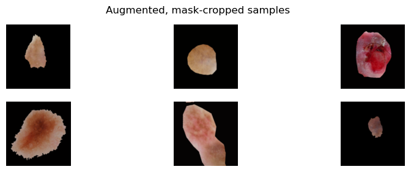

# Skin Lesion Classification 🩺

This repository contains a deep learning pipeline for **binary skin lesion classification** (benign vs malignant) on dermoscopic images.

The model uses **EfficientNetB0** with **transfer learning**, and leverages the provided **segmentation masks** purely for **preprocessing** (mask-guided cropping), not as supervision targets.

---

## 🧩 Problem statement

Given dermoscopic images of skin lesions (with optional binary masks), the task is to build a model that classifies each lesion as:

- **benign**
- **malignant**

Key points:

- Masks are **only** used to guide preprocessing (crop to lesion + optional background removal).
- The main classification supervision comes from image-level ground-truth labels in a CSV file.

---

## 📂 Data and splits

The project expects data in the format:

- A training images directory, e.g.:

    SkinLesionTrainingData/
        SkinLesionTrainingData/
            <image_id>.jpg
            <image_id>_Segmentation.png  # optional mask

- A test images directory, e.g.:

    SkinLesionTestData/
        SkinLesionTestData/
            <image_id>.jpg
            <image_id>_Segmentation.png  # optional mask

- A training ground-truth CSV, e.g.:

    SkinLesionTraining_GroundTruth.csv

Images and masks are matched by **stem** (e.g. `ISIC_000000` vs `ISIC_000000_Segmentation`).

### Train/validation split

- The code performs a **stratified split** of the training set into:
  - **85% training**
  - **15% validation**
- In the reported experiment:
  - `train = 765` images  
  - `val = 135` images  

### Class imbalance

- The benign : malignant ratio is roughly **3:1**.
- The training loop uses **class weights** computed from the training labels to compensate for this imbalance.

---

## 🧪 Preprocessing pipeline

Preprocessing is implemented in `src/data_utils.py` and the data input pipeline in `src/train.py`.

For each image:

1. **Mask-aware crop**

   - If a segmentation mask exists:
     - Compute the **tight bounding box** of the lesion.
     - Expand the box by **10% margin** on each side.
     - Crop the image to this region.
   - If no mask exists:
     - The original image is used as-is.

2. **Optional background zeroing**

   - For clean masks, the pipeline can optionally **zero out the background** outside the lesion.
   - This removes distracting background structures (e.g. ruler edges, gel bubbles) but may also remove some peri-lesional context.

3. **Resize & augment**

   - Images are resized to **224 × 224**.
   - Data augmentation includes:
     - Horizontal flip
     - Small rotation (≈ ±5°)
     - Random zoom (≈ ±10%)
     - Random contrast jitter (≈ ±10%).

4. **Normalization**

   - Pixel values are converted to `float32` and rescaled to **[0, 1]**.
   - Within the model, a rescaling layer adjusts the dynamic range for EfficientNetB0.

  <em>Augmented, mask-cropped samples used as input to the classifier.</em>

---

## 🧠 Model

The model is defined in `src/model_utils.py`.

Architecture:

- **Backbone:** `EfficientNetB0` (`tf.keras.applications.EfficientNetB0`)
  - `include_top = False`
  - `weights = "imagenet"`
- **Head:**
  - Global Average Pooling
  - Dropout `0.25`
  - Dense `1` with `sigmoid` activation (binary output)

Training configuration:

- **Loss:** Binary cross-entropy  
- **Metrics:**
  - Accuracy
  - ROC–AUC  
- **Batch size:** 32 (in the reported experiment)

---

## 🎯 Training protocol (two-stage)

Training is orchestrated from `src/train.py` using helpers from `src/model_utils.py`.

### Stage 1 – Feature extractor

- EfficientNet backbone is **frozen** (`trainable = False`).
- Learning rate: **1 × 10⁻³**
- Epochs: **5**

The model learns a lesion-specific classifier on top of pre-trained features without changing the backbone weights.

### Stage 2 – Fine-tuning

- Unfreeze the **top ≈ 60%** of the EfficientNet backbone layers.
- Keep **BatchNorm layers frozen** to avoid destabilizing training.
- Learning rate: **1 × 10⁻⁴**
- Epochs: up to **20** (with callbacks such as early stopping / best-model checkpointing).

Both stages use:

- **Data augmentation**
- **Class weights** to handle class imbalance.

Training curves (e.g. validation ROC–AUC and validation loss) can be visualized via `plot_curves` in `src/model_utils.py`.

---

## 📊 Evaluation and thresholding

Model selection is based primarily on **validation ROC–AUC**.

Because this is a **binary classifier with imbalanced data**, the default threshold 0.5 may not be optimal. The code sweeps a decision threshold **τ ∈ [0,1]** on the validation probabilities and selects the τ that maximizes **F1 score**, treating **malignant as the positive class**.

### Reported validation results

On the validation set (N = 135):

- **ROC–AUC:** 0.792  
- **Best F1 threshold:**  
  - τ = 0.62  
  - F1 = 0.507  
  - Accuracy = 0.756  
- **Balanced accuracy** at τ = 0.50: 0.727  

Confusion matrix at τ = 0.62:

|                | Pred benign | Pred malignant |
|----------------|------------:|---------------:|
| **True benign**    | 85         | 24             |
| **True malignant** | 9          | 17             |

Qualitative error analysis highlights:

- Missed **very small lesions** after downsampling to 224×224.  
- Difficulties with **low-contrast** lesions and **specular highlights** (glare).  
- Some **false positives** driven by non-diagnostic structures (rulers, bubbles, hairs).  
- Trade-off between background simplification and loss of peri-lesional context.

Possible improvements include:

- Higher input resolution or multi-scale features.  
- Stronger photometric and occlusion augmentations.  
- Synthetic artifacts (e.g. ruler, glare) to improve robustness.  
- Careful threshold tuning per deployment scenario.

---

## 📁 Repository structure

    .
    ├─ src/
    │  ├─ train.py        # main script: argument parsing, dataset setup, training, evaluation
    │  ├─ data_utils.py   # data loading, mask handling, cropping, tf.data utilities
    │  └─ model_utils.py  # model definition, fine-tuning, and training curve plotting
    ├─ requirements.txt   # Python dependencies
    ├─ .gitignore         # ignore data, weights, and local artifacts
    ├─ README.md          # this file
    └─ LICENSE            # (if present) project license

---

## 📚 Outputs

The script typically produces:

- Model weights (e.g. best checkpoints for both stages).  
- A CSV of predictions for the test set (e.g. `SkinLesionTest_Predictions.csv`).  
- Training curves for validation ROC–AUC and loss (plotted via `plot_curves`).  

---

## 🔍 Limitations & future work

Current limitations observed in the project:

- Sensitivity to **scale** (small lesions) and **illumination**.  
- Occasional reliance on **non-diagnostic artifacts**.  
- Potential loss of context when cropping tightly around the lesion.  

Future improvements could include:

- Higher-resolution inputs or multi-scale architectures.  
- Stronger and more diverse augmentations.  
- Explicit artifact augmentation (rulers, hairs, glare).  
- Experimentation with focal loss or other imbalance-robust objectives.  

---
